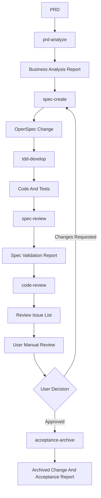

# Universal Development Flow

## Flow

```text
PRD
  -> prd-analyze
  -> business analysis report
  -> spec-create
  -> OpenSpec proposal/design/tasks/spec deltas
  -> tdd-develop
  -> code and tests
  -> spec-review
  -> OpenSpec validation report
  -> code-review
  -> review issue list
  -> user manual review checkpoint
  -> user confirms review is complete or requests changes
  -> acceptance-archive
  -> archived OpenSpec change and acceptance report
```

## Mermaid



## Command Order

1. `prd-analyze`
2. `spec-create`
3. `tdd-develop`
4. `spec-review`
5. `code-review`
6. User performs manual review outside the command flow
7. `acceptance-archive`
