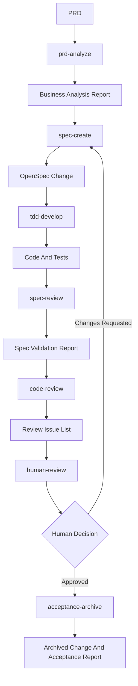

# Universal Harness Engineering Implementation Plan

> **For agentic workers:** REQUIRED SUB-SKILL: Use superpowers:subagent-driven-development (recommended) or superpowers:executing-plans to implement this plan task-by-task. Steps use checkbox (`- [ ]`) syntax for tracking.

**Goal:** Build a language-neutral, enterprise-grade harness template repository with commands, rules, skills, agents, workflows, OpenSpec directories, documentation paths, and a readable README.

**Architecture:** The harness is a documentation-first template with strict artifact contracts. Commands orchestrate the lifecycle, rules enforce governance, skills provide reusable capabilities, agents own role-specific work, workflows connect the layers, and OpenSpec folders preserve formal specification and archival state.

**Tech Stack:** Markdown, OpenSpec-compatible folder conventions, Mermaid diagrams, git.

---

## File Structure

Create these files and directories:

```text
.commands/
├── prd-analyze.md
├── spec-create.md
├── tdd-develop.md
├── spec-review.md
├── code-review.md
├── human-review.md
└── acceptance-archive.md
.rules/
├── engineering-governance.md
├── artifact-traceability.md
├── openspec-rules.md
├── tdd-rules.md
├── review-rules.md
└── acceptance-rules.md
.skills/
├── business-analysis/SKILL.md
├── openspec-authoring/SKILL.md
├── tdd-development/SKILL.md
├── tdd-development/adapters/generic.md
├── tdd-development/adapters/java.md
├── tdd-development/adapters/node.md
├── tdd-development/adapters/python.md
├── tdd-development/adapters/go.md
├── tdd-development/adapters/rust.md
├── openspec-validation/SKILL.md
├── code-review/SKILL.md
└── acceptance-archival/SKILL.md
.agents/
├── business-analyst.md
├── architect.md
├── fullstack-developer.md
├── code-reviewer.md
└── acceptance-officer.md
.workflows/
├── universal-development-flow.md
├── gate-model.md
└── artifact-contracts.md
.openspec/
├── project.md
├── specs/.gitkeep
├── changes/.gitkeep
└── archive/.gitkeep
docs/
├── analysis/.gitkeep
├── implementation/.gitkeep
├── reviews/.gitkeep
├── acceptance/.gitkeep
└── examples/sample-prd.md
README.md
```

Modify:

```text
README.md
```

This plan intentionally creates runtime-neutral Markdown first. Automation scripts are left for a later plan after the human-readable harness contracts are stable.

## Format Correction

After comparing with the repository's `.claude/commands/` and `.claude/skills/` examples, command and skill files must use Claude-compatible YAML frontmatter:

- Commands begin with `name`, `description`, `category`, and `tags`.
- Skills begin with `name`, `description`, `license`, `compatibility`, and `metadata`.

The authoritative contract template is maintained in `docs/superpowers/specs/2026-05-16-universal-harness-engineering-design.md`.

---

### Task 1: Create Harness Directory Skeleton

**Files:**

- Create directories listed in File Structure.
- Create `.gitkeep` files for empty artifact directories.

- [ ] **Step 1: Create the directory tree**

Run:

```bash
mkdir -p .commands .rules .agents .workflows
mkdir -p .skills/business-analysis .skills/openspec-authoring .skills/tdd-development/adapters
mkdir -p .skills/openspec-validation .skills/code-review .skills/acceptance-archival
mkdir -p .openspec/specs .openspec/changes .openspec/archive
mkdir -p docs/analysis docs/implementation docs/reviews docs/acceptance docs/examples
```

Expected: All directories exist.

- [ ] **Step 2: Add keep files for empty artifact directories**

Create these files:

```text
.openspec/specs/.gitkeep
.openspec/changes/.gitkeep
.openspec/archive/.gitkeep
docs/analysis/.gitkeep
docs/implementation/.gitkeep
docs/reviews/.gitkeep
docs/acceptance/.gitkeep
```

Each file should be empty.

- [ ] **Step 3: Verify skeleton**

Run:

```bash
find .commands .rules .skills .agents .workflows .openspec docs -maxdepth 3 -type d | sort
```

Expected: The output includes every directory listed in the File Structure section.

- [ ] **Step 4: Commit**

Run:

```bash
git add .commands .rules .skills .agents .workflows .openspec docs
git commit -m "chore: add universal harness directory skeleton"
```

---

### Task 2: Add Command Contracts

**Files:**

- Create: `.commands/prd-analyze.md`
- Create: `.commands/spec-create.md`
- Create: `.commands/tdd-develop.md`
- Create: `.commands/spec-review.md`
- Create: `.commands/code-review.md`
- Create: `.commands/human-review.md`
- Create: `.commands/acceptance-archive.md`

- [ ] **Step 1: Create `prd-analyze` command**

Write `.commands/prd-analyze.md`:

```markdown
# Command: prd-analyze

## Purpose

Convert a PRD into a structured business analysis report that can be used as input for OpenSpec specification.

## Inputs

- PRD document path or pasted PRD content.
- Optional business context, user stories, issue links, customer feedback, or domain notes.

## Responsible Agent

Business Analyst.

## Required Skills

- `business-analysis`

## Enforced Rules

- `engineering-governance`
- `artifact-traceability`

## Procedure

1. Assign or confirm a stable `change-id`.
2. Read the PRD and supporting context.
3. Extract the business goal and scope.
4. Perform 5W1H analysis.
5. Identify actors and system boundaries.
6. Produce use case, process flow, and state model where applicable.
7. Extract the feature point matrix.
8. Record assumptions, ambiguities, risks, and open questions.
9. Write the business analysis report.

## Output Artifacts

- `docs/analysis/<change-id>-business-analysis.md`

## Quality Gate

The report must include executive summary, 5W1H, actors, use case diagram, process flow, feature matrix, non-functional requirements, risks, and recommended OpenSpec scope.

## Failure Handling

If the PRD is ambiguous, record questions and block `spec-create` unless a human owner approves explicit assumptions.

## Next Command

`spec-create`
```

- [ ] **Step 2: Create `spec-create` command**

Write `.commands/spec-create.md`:

```markdown
# Command: spec-create

## Purpose

Convert the PRD and business analysis report into an OpenSpec change.

## Inputs

- PRD document.
- `docs/analysis/<change-id>-business-analysis.md`

## Responsible Agent

Architect.

## Required Skills

- `openspec-authoring`
- `openspec-validation`

## Enforced Rules

- `engineering-governance`
- `artifact-traceability`
- `openspec-rules`

## Procedure

1. Read the PRD and business analysis report.
2. Identify affected capabilities.
3. Create `.openspec/changes/<change-id>/proposal.md`.
4. Create `.openspec/changes/<change-id>/design.md`.
5. Create `.openspec/changes/<change-id>/tasks.md`.
6. Create or update capability spec deltas under `.openspec/changes/<change-id>/specs/`.
7. Run OpenSpec validation.
8. Record assumptions, risks, and validation result.

## Output Artifacts

- `.openspec/changes/<change-id>/proposal.md`
- `.openspec/changes/<change-id>/design.md`
- `.openspec/changes/<change-id>/tasks.md`
- `.openspec/changes/<change-id>/specs/<capability>/spec.md`

## Quality Gate

OpenSpec validation must pass, or an explicit exception must be recorded before implementation.

## Failure Handling

If validation fails, update the OpenSpec change and rerun validation. If feature points cannot map to requirements, return to `prd-analyze`.

## Next Command

`tdd-develop`
```

- [ ] **Step 3: Create `tdd-develop` command**

Write `.commands/tdd-develop.md`:

```markdown
# Command: tdd-develop

## Purpose

Implement an OpenSpec change using test-driven development.

## Inputs

- `.openspec/changes/<change-id>/`
- `docs/analysis/<change-id>-business-analysis.md`
- Existing repository source code.

## Responsible Agent

Fullstack Developer.

## Required Skills

- `tdd-development`

## Enforced Rules

- `engineering-governance`
- `artifact-traceability`
- `tdd-rules`

## Procedure

1. Inspect the repository and detect language, build tool, and test framework.
2. Select the matching TDD adapter.
3. For each OpenSpec task, write a failing test first.
4. Run the focused test and capture the failing result.
5. Implement the minimal production change.
6. Run the focused test and capture the passing result.
7. Refactor where needed.
8. Run relevant regression tests.
9. Write implementation notes.

## Output Artifacts

- Production code changes.
- Test code changes.
- `docs/implementation/<change-id>-implementation-notes.md`

## Quality Gate

All relevant tests must pass, and implementation notes must include exact commands and summarized results.

## Failure Handling

If no test framework exists, propose a minimal test strategy before implementation. If TDD cannot be applied directly, record an exception and use characterization or integration tests.

## Next Command

`spec-review`
```

- [ ] **Step 4: Create review and acceptance commands**

Write `.commands/spec-review.md`:

```markdown
# Command: spec-review

## Purpose

Validate that the OpenSpec change is internally consistent and still matches the implemented behavior.

## Inputs

- `.openspec/changes/<change-id>/`
- `docs/implementation/<change-id>-implementation-notes.md`

## Responsible Agent

Architect or Spec Reviewer.

## Required Skills

- `openspec-validation`

## Enforced Rules

- `openspec-rules`
- `artifact-traceability`

## Procedure

1. Run OpenSpec validation.
2. Check that every feature point maps to a requirement.
3. Check that every implemented behavior maps back to the OpenSpec change.
4. Record validation commands and results.
5. Produce a spec validation report.

## Output Artifacts

- `docs/reviews/<change-id>-spec-validation.md`

## Quality Gate

Validation must pass or list concrete blocking issues.

## Failure Handling

If the spec is incomplete, return to `spec-create`. If implementation does not match the spec, route to `tdd-develop`.

## Next Command

`code-review`
```

Write `.commands/code-review.md`:

```markdown
# Command: code-review

## Purpose

Review implementation changes against OpenSpec, tests, maintainability, security, and operational risk.

## Inputs

- Implementation diff.
- `.openspec/changes/<change-id>/`
- `docs/implementation/<change-id>-implementation-notes.md`
- `docs/reviews/<change-id>-spec-validation.md`

## Responsible Agent

Code Reviewer.

## Required Skills

- `code-review`

## Enforced Rules

- `review-rules`
- `artifact-traceability`

## Procedure

1. Inspect the implementation diff.
2. Compare behavior against OpenSpec requirements.
3. Check tests against requirements and risk.
4. Review correctness, maintainability, security, observability, and migration risk.
5. Produce structured findings ordered by severity.

## Output Artifacts

- `docs/reviews/<change-id>-code-review.md`

## Quality Gate

High and critical findings must be fixed or explicitly accepted as risks before human approval.

## Failure Handling

If issues are found, route back to `tdd-develop` after recording findings.

## Next Command

`human-review`
```

Write `.commands/human-review.md`:

```markdown
# Command: human-review

## Purpose

Record a human approval, rejection, change request, or accepted-risk decision.

## Inputs

- `docs/analysis/<change-id>-business-analysis.md`
- `.openspec/changes/<change-id>/`
- `docs/implementation/<change-id>-implementation-notes.md`
- `docs/reviews/<change-id>-spec-validation.md`
- `docs/reviews/<change-id>-code-review.md`

## Responsible Agent

Human Owner.

## Required Skills

- None. This is a human gate.

## Enforced Rules

- `engineering-governance`
- `acceptance-rules`

## Procedure

1. Present all evidence to the human reviewer.
2. Record the decision.
3. Record accepted risks and required follow-ups.
4. Route back to the correct command when changes are requested.

## Output Artifacts

- `docs/acceptance/<change-id>-human-review.md`

## Quality Gate

The decision must be explicit: Approved, Changes Requested, Rejected, or Approved With Accepted Risks.

## Failure Handling

If no human decision exists, block `acceptance-archive`.

## Next Command

`acceptance-archive`
```

Write `.commands/acceptance-archive.md`:

```markdown
# Command: acceptance-archive

## Purpose

Validate final evidence and archive the completed OpenSpec change.

## Inputs

- `.openspec/changes/<change-id>/`
- `docs/acceptance/<change-id>-human-review.md`
- Test evidence.
- Review reports.

## Responsible Agent

Acceptance Officer.

## Required Skills

- `acceptance-archival`
- `openspec-validation`

## Enforced Rules

- `acceptance-rules`
- `artifact-traceability`
- `openspec-rules`

## Procedure

1. Verify required artifacts exist.
2. Verify OpenSpec validation result.
3. Confirm review findings are fixed or accepted.
4. Confirm human approval.
5. Archive the OpenSpec change.
6. Create the acceptance report.

## Output Artifacts

- `.openspec/archive/<date>-<change-id>/`
- `docs/acceptance/<change-id>-acceptance-report.md`

## Quality Gate

Acceptance report must link PRD, analysis, OpenSpec, implementation notes, review reports, test evidence, and human decision.

## Failure Handling

If evidence is missing, stop archival and leave the change open.

## Next Command

None. The change is complete.
```

- [ ] **Step 5: Verify command files**

Run:

```bash
rg -n "^# Command:|^## Purpose|^## Inputs|^## Quality Gate|^## Next Command" .commands
```

Expected: Every command file has the common sections.

- [ ] **Step 6: Commit**

Run:

```bash
git add .commands
git commit -m "docs: add universal harness command contracts"
```

---

### Task 3: Add Enterprise Rules

**Files:**

- Create: `.rules/engineering-governance.md`
- Create: `.rules/artifact-traceability.md`
- Create: `.rules/openspec-rules.md`
- Create: `.rules/tdd-rules.md`
- Create: `.rules/review-rules.md`
- Create: `.rules/acceptance-rules.md`

- [ ] **Step 1: Create governance and traceability rules**

Write `.rules/engineering-governance.md`:

```markdown
# Rule: Engineering Governance

## Intent

Ensure every AI-assisted change follows an auditable senior-engineer workflow.

## Requirements

- Do not start implementation from a PRD until business analysis and OpenSpec artifacts exist.
- Record assumptions before acting on ambiguous requirements.
- Keep changes scoped to the approved OpenSpec change.
- Preserve human review as a required gate before acceptance archival.
- Record every exception with owner, reason, impact, and follow-up.

## Gate Impact

Violations block the next lifecycle command unless a human owner explicitly approves an exception.
```

Write `.rules/artifact-traceability.md`:

```markdown
# Rule: Artifact Traceability

## Intent

Make every requirement, decision, implementation, test, review, and acceptance result traceable.

## Requirements

- Use a stable `change-id` for every lifecycle artifact.
- Link PRD, business analysis, OpenSpec change, implementation notes, reviews, human decision, and acceptance report.
- Store generated artifacts under the paths defined by `.workflows/artifact-contracts.md`.
- Include exact validation and test commands in implementation or review notes.
- Do not archive a change when required artifacts are missing.

## Gate Impact

Missing traceability blocks acceptance archival.
```

- [ ] **Step 2: Create OpenSpec and TDD rules**

Write `.rules/openspec-rules.md`:

```markdown
# Rule: OpenSpec

## Intent

Use OpenSpec as the canonical specification and acceptance contract.

## Requirements

- Every change must include proposal, design, tasks, and capability spec deltas when behavior changes.
- Every business feature point must map to an OpenSpec requirement or be explicitly marked out of scope.
- OpenSpec validation must run before implementation and before acceptance archival.
- Failed validation blocks development unless an explicit exception is recorded.
- Accepted OpenSpec changes must be archived after final approval.

## Gate Impact

Invalid or missing OpenSpec artifacts block `tdd-develop` and `acceptance-archive`.
```

Write `.rules/tdd-rules.md`:

```markdown
# Rule: Test-Driven Development

## Intent

Make implementation evidence-driven and regression-resistant.

## Requirements

- Write a failing test before production code for every implementable behavior.
- Capture the focused failing result, passing result, and relevant regression result.
- Prefer the repository's existing test framework and conventions.
- If no test framework exists, propose a minimal test strategy before coding.
- If TDD cannot be applied directly, record an exception and use characterization or integration tests.

## Gate Impact

Missing test evidence blocks review unless a human owner accepts the risk.
```

- [ ] **Step 3: Create review and acceptance rules**

Write `.rules/review-rules.md`:

```markdown
# Rule: Review

## Intent

Ensure every change is reviewed for correctness, specification alignment, and operational risk.

## Requirements

- Review findings must be ordered by severity.
- Each finding must include severity, location, requirement, problem, impact, recommendation, and status.
- High and critical findings must be fixed or explicitly accepted before human approval.
- If no issues are found, the review must still state residual risks and test gaps.
- Review must not silently mutate scope or implementation without recording the finding.

## Gate Impact

Open high or critical findings block human approval.
```

Write `.rules/acceptance-rules.md`:

```markdown
# Rule: Acceptance

## Intent

Accept only changes with complete evidence and explicit human approval.

## Requirements

- Human approval is required before archival.
- Accepted risks must be listed explicitly.
- Acceptance reports must link all required evidence.
- Archived changes are immutable except for administrative correction notes.
- If archival fails, the OpenSpec change remains open.

## Gate Impact

Missing approval, unresolved review blockers, or incomplete evidence blocks acceptance archival.
```

- [ ] **Step 4: Verify rule files**

Run:

```bash
rg -n "^# Rule:|^## Intent|^## Requirements|^## Gate Impact" .rules
```

Expected: Every rule file has the common sections.

- [ ] **Step 5: Commit**

Run:

```bash
git add .rules
git commit -m "docs: add enterprise harness rules"
```

---

### Task 4: Add Skills And Language Adapters

**Files:**

- Create all `.skills/**/SKILL.md` files.
- Create TDD adapters under `.skills/tdd-development/adapters/`.

- [ ] **Step 1: Create business analysis and OpenSpec authoring skills**

Write `.skills/business-analysis/SKILL.md`:

```markdown
# Skill: business-analysis

## Trigger

Use when a PRD must be converted into a structured business analysis report.

## Purpose

Extract business intent, actors, flows, states, feature points, risks, and OpenSpec-ready scope.

## Inputs

- PRD.
- Optional domain context.

## Procedure

1. Identify business objective and success criteria.
2. Produce 5W1H analysis.
3. Identify actors and boundaries.
4. Produce Mermaid use case diagram.
5. Produce Mermaid process flow.
6. Produce Mermaid state diagram when domain state exists.
7. Build feature point matrix.
8. Record assumptions, risks, and open questions.
9. Write `docs/analysis/<change-id>-business-analysis.md`.

## Outputs

- Business analysis report.

## Quality Checklist

- The analysis maps business goals to feature points.
- Diagrams are readable as plain Mermaid.
- Risks and assumptions are explicit.
- Recommended OpenSpec scope is clear.

## Adapters

None.

## Examples

Use this skill before `spec-create`.
```

Write `.skills/openspec-authoring/SKILL.md`:

```markdown
# Skill: openspec-authoring

## Trigger

Use when business analysis must be converted into an OpenSpec change.

## Purpose

Create proposal, design, tasks, and capability spec deltas.

## Inputs

- PRD.
- Business analysis report.

## Procedure

1. Choose a stable `change-id`.
2. Identify affected capabilities.
3. Create proposal.
4. Create design.
5. Create task list.
6. Create spec deltas.
7. Map feature points to requirements.
8. Prepare for OpenSpec validation.

## Outputs

- `.openspec/changes/<change-id>/proposal.md`
- `.openspec/changes/<change-id>/design.md`
- `.openspec/changes/<change-id>/tasks.md`
- `.openspec/changes/<change-id>/specs/<capability>/spec.md`

## Quality Checklist

- Every requirement is testable.
- Every feature point is mapped or marked out of scope.
- Tasks are concrete enough for TDD implementation.
- Risks and assumptions are recorded.

## Adapters

None.

## Examples

Use this skill inside `spec-create`.
```

- [ ] **Step 2: Create TDD development skill**

Write `.skills/tdd-development/SKILL.md`:

```markdown
# Skill: tdd-development

## Trigger

Use when implementing an OpenSpec change.

## Purpose

Drive implementation through failing tests, minimal code, passing tests, refactoring, and verification evidence.

## Inputs

- OpenSpec change.
- Business analysis report.
- Existing codebase.

## Procedure

1. Detect ecosystem and test framework.
2. Select the matching adapter from `adapters/`.
3. For each requirement, write a focused failing test.
4. Run the test and capture failure.
5. Implement minimal production code.
6. Run the focused test and capture pass.
7. Refactor only when behavior remains covered.
8. Run relevant regression tests.
9. Write implementation notes.

## Outputs

- Code changes.
- Test changes.
- `docs/implementation/<change-id>-implementation-notes.md`

## Quality Checklist

- Tests precede implementation.
- Test commands and outcomes are recorded.
- Implementation scope matches OpenSpec tasks.
- Exceptions are explicit.

## Adapters

- `adapters/generic.md`
- `adapters/java.md`
- `adapters/node.md`
- `adapters/python.md`
- `adapters/go.md`
- `adapters/rust.md`

## Examples

Use this skill inside `tdd-develop`.
```

- [ ] **Step 3: Create TDD adapters**

Write `.skills/tdd-development/adapters/generic.md`:

```markdown
# TDD Adapter: Generic

## Detection

Use when no specific ecosystem adapter matches.

## Test Strategy

- Identify existing test files and naming conventions.
- Prefer the smallest executable test available.
- If no tests exist, propose a minimal test harness before implementation.

## Commands

- Focused test: repository-specific.
- Regression test: repository-specific.

## Review Risks

- Untested behavior.
- Manual-only validation.
- Hidden framework conventions.
```

Write `.skills/tdd-development/adapters/java.md`:

```markdown
# TDD Adapter: Java

## Detection

- Maven: `pom.xml`
- Gradle: `build.gradle`, `settings.gradle`, `build.gradle.kts`

## Test Strategy

- Prefer existing JUnit, TestNG, Mockito, or Spring test conventions.
- Place tests under `src/test/java` unless the project uses another convention.
- Use module-scoped test commands in multi-module repositories.

## Commands

- Maven focused test: `mvn -Dtest=<TestClass>#<testMethod> test`
- Maven module test: `mvn -pl <module> -Dtest=<TestClass> test`
- Gradle test: `./gradlew test`

## Review Risks

- Tests requiring external services.
- Spring context tests used where unit tests would be enough.
- Multi-module dependency drift.
```

Write `.skills/tdd-development/adapters/node.md`:

```markdown
# TDD Adapter: Node

## Detection

- `package.json`
- Lockfiles such as `package-lock.json`, `pnpm-lock.yaml`, or `yarn.lock`

## Test Strategy

- Prefer existing Jest, Vitest, Mocha, Playwright, or framework-specific tests.
- Use the package manager already used by the repository.
- Keep unit and end-to-end tests separate.

## Commands

- npm: `npm test`
- pnpm: `pnpm test`
- yarn: `yarn test`

## Review Risks

- Snapshot churn.
- Unmocked network calls.
- Flaky browser tests.
```

Write `.skills/tdd-development/adapters/python.md`:

```markdown
# TDD Adapter: Python

## Detection

- `pyproject.toml`
- `requirements.txt`
- `setup.py`

## Test Strategy

- Prefer existing pytest or unittest conventions.
- Place tests under existing `tests/` layout.
- Use fixtures consistent with the repository.

## Commands

- Focused pytest: `python -m pytest tests/path/test_file.py::test_name -q`
- Regression pytest: `python -m pytest`

## Review Risks

- Global state between tests.
- Environment-dependent tests.
- Mocking implementation details instead of behavior.
```

Write `.skills/tdd-development/adapters/go.md`:

```markdown
# TDD Adapter: Go

## Detection

- `go.mod`

## Test Strategy

- Place tests in `*_test.go` files near the package under test.
- Prefer table-driven tests for multiple cases.
- Use package-level tests unless external behavior requires integration tests.

## Commands

- Focused test: `go test ./path/to/package -run TestName`
- Regression test: `go test ./...`

## Review Risks

- Tests coupled to execution order.
- Missing error-path coverage.
- Race-sensitive code without race testing.
```

Write `.skills/tdd-development/adapters/rust.md`:

```markdown
# TDD Adapter: Rust

## Detection

- `Cargo.toml`

## Test Strategy

- Prefer unit tests near implementation and integration tests under `tests/`.
- Use `Result` assertions for error behavior.
- Keep feature-flag-specific behavior explicit.

## Commands

- Focused test: `cargo test <test_name>`
- Regression test: `cargo test`

## Review Risks

- Missing error variant coverage.
- Feature flag drift.
- Overly broad integration tests.
```

- [ ] **Step 4: Create validation, review, and archival skills**

Write `.skills/openspec-validation/SKILL.md`:

```markdown
# Skill: openspec-validation

## Trigger

Use when an OpenSpec change must be validated.

## Purpose

Verify OpenSpec structure, requirement mapping, and readiness for implementation or acceptance.

## Inputs

- `.openspec/changes/<change-id>/`

## Procedure

1. Check proposal, design, tasks, and specs exist.
2. Run the configured OpenSpec validation command when available.
3. Check feature-to-requirement mapping.
4. Record validation result.
5. Report blocking issues.

## Outputs

- `docs/reviews/<change-id>-spec-validation.md`

## Quality Checklist

- Validation command and result are recorded.
- Missing artifacts are listed.
- Requirement mapping gaps are explicit.

## Adapters

None.

## Examples

Use before implementation and before archival.
```

Write `.skills/code-review/SKILL.md`:

```markdown
# Skill: code-review

## Trigger

Use when implementation must be reviewed against OpenSpec and engineering rules.

## Purpose

Produce a structured issue list focused on correctness, spec alignment, tests, maintainability, security, and operational risk.

## Inputs

- Implementation diff.
- OpenSpec change.
- Test evidence.

## Procedure

1. Review requirements and implementation diff.
2. Check behavior against OpenSpec.
3. Check test coverage against risk.
4. Identify findings.
5. Order findings by severity.
6. Write review report.

## Outputs

- `docs/reviews/<change-id>-code-review.md`

## Quality Checklist

- Findings include severity, location, requirement, problem, impact, recommendation, and status.
- High and critical findings are clearly blocking.
- No-issue reviews still state residual risk.

## Adapters

None.

## Examples

Use after `spec-review`.
```

Write `.skills/acceptance-archival/SKILL.md`:

```markdown
# Skill: acceptance-archival

## Trigger

Use when a change is approved and ready to archive.

## Purpose

Confirm evidence completeness, archive the OpenSpec change, and produce final acceptance report.

## Inputs

- OpenSpec change.
- Human review decision.
- Test evidence.
- Review reports.

## Procedure

1. Verify all required artifacts exist.
2. Confirm OpenSpec validation passed.
3. Confirm review blockers are fixed or accepted.
4. Confirm human approval.
5. Archive the OpenSpec change.
6. Write acceptance report.

## Outputs

- `.openspec/archive/<date>-<change-id>/`
- `docs/acceptance/<change-id>-acceptance-report.md`

## Quality Checklist

- Acceptance report links every evidence artifact.
- Accepted risks are explicit.
- Missing evidence blocks archival.

## Adapters

None.

## Examples

Use only after `human-review` approves the change.
```

- [ ] **Step 5: Verify skill files**

Run:

```bash
rg -n "^# Skill:|^# TDD Adapter:|^## Trigger|^## Quality Checklist|^## Detection" .skills
```

Expected: Every skill and adapter has the expected sections.

- [ ] **Step 6: Commit**

Run:

```bash
git add .skills
git commit -m "docs: add harness skills and language adapters"
```

---

### Task 5: Add Agent Contracts

**Files:**

- Create: `.agents/business-analyst.md`
- Create: `.agents/architect.md`
- Create: `.agents/fullstack-developer.md`
- Create: `.agents/code-reviewer.md`
- Create: `.agents/acceptance-officer.md`

- [ ] **Step 1: Create business analyst and architect agents**

Write `.agents/business-analyst.md`:

```markdown
# Agent: Business Analyst

## Mission

Translate PRD input into structured business analysis artifacts that make scope, actors, flows, states, and feature points explicit.

## Responsibilities

- Perform 5W1H analysis.
- Identify actors and system boundaries.
- Produce use case, flow, and state diagrams.
- Build feature point matrix.
- Record assumptions, risks, and open questions.

## Inputs

- PRD.
- Optional business context.

## Outputs

- `docs/analysis/<change-id>-business-analysis.md`

## Required Skills

- `business-analysis`

## Rules

- `engineering-governance`
- `artifact-traceability`

## Handoff Protocol

Pass the analysis report, change ID, assumptions, risks, and recommended OpenSpec scope to the Architect.

## Refusal Conditions

Refuse to mark analysis complete when business goals, actors, or feature points are missing.
```

Write `.agents/architect.md`:

```markdown
# Agent: Architect

## Mission

Convert business analysis into an OpenSpec change that is testable, validated, and ready for TDD implementation.

## Responsibilities

- Identify affected capabilities.
- Create OpenSpec proposal, design, tasks, and spec deltas.
- Map business feature points to requirements.
- Run OpenSpec validation.
- Resolve or record specification risks.

## Inputs

- PRD.
- Business analysis report.

## Outputs

- `.openspec/changes/<change-id>/`
- `docs/reviews/<change-id>-spec-validation.md` when validating.

## Required Skills

- `openspec-authoring`
- `openspec-validation`

## Rules

- `openspec-rules`
- `artifact-traceability`

## Handoff Protocol

Pass the validated OpenSpec change, task list, assumptions, and validation result to the Fullstack Developer.

## Refusal Conditions

Refuse to approve implementation when OpenSpec validation fails unless a human owner records an exception.
```

- [ ] **Step 2: Create developer, reviewer, and acceptance agents**

Write `.agents/fullstack-developer.md`:

```markdown
# Agent: Fullstack Developer

## Mission

Implement OpenSpec tasks using TDD and produce verifiable implementation evidence.

## Responsibilities

- Detect language, build tool, and test framework.
- Select the appropriate TDD adapter.
- Write failing tests before implementation.
- Implement minimal code.
- Run focused and regression tests.
- Record implementation notes.

## Inputs

- OpenSpec change.
- Business analysis report.
- Existing repository code.

## Outputs

- Code changes.
- Test changes.
- `docs/implementation/<change-id>-implementation-notes.md`

## Required Skills

- `tdd-development`

## Rules

- `tdd-rules`
- `engineering-governance`
- `artifact-traceability`

## Handoff Protocol

Pass implementation notes, changed files, test evidence, and known risks to the Spec Reviewer and Code Reviewer.

## Refusal Conditions

Refuse to implement when no OpenSpec change exists unless a human owner explicitly approves an exception.
```

Write `.agents/code-reviewer.md`:

```markdown
# Agent: Code Reviewer

## Mission

Review implementation changes for correctness, specification alignment, tests, maintainability, security, and operational risk.

## Responsibilities

- Inspect implementation diff.
- Compare behavior with OpenSpec requirements.
- Evaluate test evidence.
- Produce structured findings.
- Identify residual risks when no issues are found.

## Inputs

- Implementation diff.
- OpenSpec change.
- Implementation notes.
- Spec validation report.

## Outputs

- `docs/reviews/<change-id>-code-review.md`

## Required Skills

- `code-review`

## Rules

- `review-rules`
- `artifact-traceability`

## Handoff Protocol

Pass review findings and blocking status to the Human Owner.

## Refusal Conditions

Refuse to mark review complete when the diff, OpenSpec change, or test evidence is missing.
```

Write `.agents/acceptance-officer.md`:

```markdown
# Agent: Acceptance Officer

## Mission

Validate final evidence, enforce the human review gate, archive the OpenSpec change, and produce the acceptance report.

## Responsibilities

- Verify required artifacts.
- Confirm OpenSpec validation.
- Confirm review blockers are fixed or accepted.
- Confirm human approval.
- Archive accepted changes.
- Write acceptance report.

## Inputs

- OpenSpec change.
- Human review decision.
- Test evidence.
- Review reports.

## Outputs

- `.openspec/archive/<date>-<change-id>/`
- `docs/acceptance/<change-id>-acceptance-report.md`

## Required Skills

- `acceptance-archival`
- `openspec-validation`

## Rules

- `acceptance-rules`
- `artifact-traceability`
- `openspec-rules`

## Handoff Protocol

Record final acceptance status and archived artifact paths.

## Refusal Conditions

Refuse archival when human approval, validation evidence, or review resolution is missing.
```

- [ ] **Step 3: Verify agent files**

Run:

```bash
rg -n "^# Agent:|^## Mission|^## Responsibilities|^## Handoff Protocol|^## Refusal Conditions" .agents
```

Expected: Every agent file has the common sections.

- [ ] **Step 4: Commit**

Run:

```bash
git add .agents
git commit -m "docs: add harness agent role contracts"
```

---

### Task 6: Add Workflow And Artifact Contracts

**Files:**

- Create: `.workflows/universal-development-flow.md`
- Create: `.workflows/gate-model.md`
- Create: `.workflows/artifact-contracts.md`
- Create: `.openspec/project.md`

- [ ] **Step 1: Create universal development flow**

Write `.workflows/universal-development-flow.md`:

```markdown
# Universal Development Flow

## Flow

```text
PRD
  -> prd-analyze
  -> business analysis report
  -> spec-create
  -> OpenSpec proposal/design/tasks/spec deltas
  -> tdd-develop
  -> code and tests
  -> spec-review
  -> OpenSpec validation report
  -> code-review
  -> review issue list
  -> human-review
  -> human approval or change request
  -> acceptance-archive
  -> archived OpenSpec change and acceptance report
```

## Mermaid



## Command Order

1. `prd-analyze`
2. `spec-create`
3. `tdd-develop`
4. `spec-review`
5. `code-review`
6. `human-review`
7. `acceptance-archive`
```

- [ ] **Step 2: Create gate model**

Write `.workflows/gate-model.md`:

```markdown
# Gate Model

## Business Analysis Gate

Required artifacts:

- `docs/analysis/<change-id>-business-analysis.md`

Pass criteria:

- 5W1H, actors, flow, state model where applicable, feature matrix, risks, and OpenSpec scope are present.

## Specification Gate

Required artifacts:

- `.openspec/changes/<change-id>/proposal.md`
- `.openspec/changes/<change-id>/design.md`
- `.openspec/changes/<change-id>/tasks.md`
- `.openspec/changes/<change-id>/specs/<capability>/spec.md`

Pass criteria:

- OpenSpec validation passes or an exception is recorded.

## Development Gate

Required artifacts:

- Code changes.
- Test changes.
- `docs/implementation/<change-id>-implementation-notes.md`

Pass criteria:

- Focused and relevant regression tests pass.
- TDD evidence is recorded.

## Review Gate

Required artifacts:

- `docs/reviews/<change-id>-spec-validation.md`
- `docs/reviews/<change-id>-code-review.md`

Pass criteria:

- OpenSpec validation passes.
- High and critical review findings are fixed or accepted.

## Acceptance Gate

Required artifacts:

- `docs/acceptance/<change-id>-human-review.md`
- `docs/acceptance/<change-id>-acceptance-report.md`
- `.openspec/archive/<date>-<change-id>/`

Pass criteria:

- Human approval exists.
- Required evidence is linked.
- OpenSpec change is archived.
```

- [ ] **Step 3: Create artifact contracts and OpenSpec project file**

Write `.workflows/artifact-contracts.md`:

```markdown
# Artifact Contracts

## Change ID

Use this format:

```text
<domain>-<short-feature-name>-<yyyymmdd>
```

Example:

```text
membership-coupon-refund-20260516
```

## Required Artifact Paths

| Artifact | Path |
| --- | --- |
| Business analysis | `docs/analysis/<change-id>-business-analysis.md` |
| OpenSpec change | `.openspec/changes/<change-id>/` |
| Implementation notes | `docs/implementation/<change-id>-implementation-notes.md` |
| Spec validation | `docs/reviews/<change-id>-spec-validation.md` |
| Code review | `docs/reviews/<change-id>-code-review.md` |
| Human review | `docs/acceptance/<change-id>-human-review.md` |
| Acceptance report | `docs/acceptance/<change-id>-acceptance-report.md` |
| Archive | `.openspec/archive/<date>-<change-id>/` |

## Review Finding Format

```markdown
## Finding <number>: <title>

- Severity: Critical | High | Medium | Low | Nit
- Location: `<file>:<line>`
- Requirement: `<OpenSpec requirement id>`
- Problem:
- Impact:
- Recommendation:
- Status: Open | Fixed | Accepted Risk
```

## Human Decision Format

```markdown
# Human Review Decision

- Change ID:
- Reviewer:
- Decision: Approved | Changes Requested | Rejected | Approved With Accepted Risks
- Accepted Risks:
- Required Follow-ups:
- Decision Time:
```
```

Write `.openspec/project.md`:

```markdown
# OpenSpec Project

## Purpose

This folder stores formal specification artifacts for the universal harness workflow.

## Structure

- `specs/` stores accepted capability specifications.
- `changes/` stores active OpenSpec changes.
- `archive/` stores accepted and archived changes.

## Harness Rule

OpenSpec is the canonical source for development scope and acceptance requirements.
```

- [ ] **Step 4: Verify workflow files**

Run:

```bash
rg -n "^# Universal Development Flow|^# Gate Model|^# Artifact Contracts|^# OpenSpec Project" .workflows .openspec/project.md
```

Expected: All workflow and OpenSpec project files are found.

- [ ] **Step 5: Commit**

Run:

```bash
git add .workflows .openspec/project.md
git commit -m "docs: add harness workflow and artifact contracts"
```

---

### Task 7: Add Sample PRD And README

**Files:**

- Create: `docs/examples/sample-prd.md`
- Modify: `README.md`

- [ ] **Step 1: Create sample PRD**

Write `docs/examples/sample-prd.md`:

```markdown
# Sample PRD: Account Email Change

## Background

Users need a secure way to change their account email address while preserving account ownership and auditability.

## Goal

Allow authenticated users to request an email change, verify the new email address, and complete the change only after verification.

## Users

- Authenticated account owner.
- System notification service.
- Support operator who may inspect audit records.

## Requirements

- User can submit a new email address.
- System sends a verification message to the new email address.
- Email address changes only after verification succeeds.
- Expired verification requests cannot be used.
- All email change attempts are auditable.

## Non-Functional Requirements

- Verification tokens must expire.
- The flow must avoid account takeover risk.
- The system must record audit events.
```

- [ ] **Step 2: Replace README with harness overview**

Write `README.md`:

```markdown
# Harness Engineer Template

Universal, enterprise-grade harness engineering template for AI-assisted software development.

This repository defines a reusable workflow that can support any language or framework by separating development into commands, rules, skills, agents, workflows, OpenSpec artifacts, and auditable evidence.

## Core Flow

```text
PRD
  -> prd-analyze
  -> spec-create
  -> tdd-develop
  -> spec-review
  -> code-review
  -> human-review
  -> acceptance-archive
```

## Layers

| Layer | Path | Purpose |
| --- | --- | --- |
| Commands | `.commands/` | Lifecycle orchestration |
| Rules | `.rules/` | Enterprise governance constraints |
| Skills | `.skills/` | Reusable task capabilities |
| Agents | `.agents/` | Role-specific responsibilities and handoffs |
| Workflows | `.workflows/` | End-to-end process and gate model |
| OpenSpec | `.openspec/` | Specification, change, and archive state |
| Docs | `docs/` | Analysis, implementation, review, and acceptance evidence |

## Recommended Usage

1. Start with a PRD.
2. Run `prd-analyze` to produce business analysis.
3. Run `spec-create` to produce an OpenSpec change.
4. Run `tdd-develop` to implement through tests.
5. Run `spec-review` and `code-review`.
6. Record human approval with `human-review`.
7. Complete the lifecycle with `acceptance-archive`.

## Design Specification

See `docs/superpowers/specs/2026-05-16-universal-harness-engineering-design.md`.

## Sample PRD

See `docs/examples/sample-prd.md`.
```

- [ ] **Step 3: Verify README references**

Run:

```bash
rg -n "prd-analyze|spec-create|tdd-develop|acceptance-archive|sample-prd" README.md docs/examples/sample-prd.md
```

Expected: README references the command flow and sample PRD.

- [ ] **Step 4: Commit**

Run:

```bash
git add README.md docs/examples/sample-prd.md
git commit -m "docs: add harness overview and sample PRD"
```

---

### Task 8: Final Consistency Verification

**Files:**

- Verify all created files.
- Modify any file only if verification reveals inconsistency.

- [ ] **Step 1: Verify required files exist**

Run:

```bash
test -f .commands/prd-analyze.md
test -f .commands/spec-create.md
test -f .commands/tdd-develop.md
test -f .commands/spec-review.md
test -f .commands/code-review.md
test -f .commands/human-review.md
test -f .commands/acceptance-archive.md
test -f .rules/engineering-governance.md
test -f .skills/business-analysis/SKILL.md
test -f .agents/business-analyst.md
test -f .workflows/universal-development-flow.md
test -f .openspec/project.md
test -f docs/examples/sample-prd.md
```

Expected: All commands exit successfully.

- [ ] **Step 2: Verify no unresolved scaffold markers**

Run:

```bash
rg -n "T[B]D|T[O]DO|implement[ ]later|fill[ ]in|待[定]" .commands .rules .skills .agents .workflows .openspec README.md docs/analysis docs/implementation docs/reviews docs/acceptance docs/examples
```

Expected: No matches.

- [ ] **Step 3: Verify command names are referenced consistently**

Run:

```bash
rg -n "prd-analyze|spec-create|tdd-develop|spec-review|code-review|human-review|acceptance-archive" .commands .workflows README.md
```

Expected: All seven command names appear in command files, workflow docs, and README.

- [ ] **Step 4: Check git status**

Run:

```bash
git status --short
```

Expected: Clean working tree.

- [ ] **Step 5: Final commit if verification fixes were needed**

If Step 1 through Step 3 required edits, run:

```bash
git add .commands .rules .skills .agents .workflows .openspec README.md docs
git commit -m "docs: align harness template contracts"
```

Expected: No commit is needed if verification passed without edits.

---

## Self-Review

- Spec coverage: This plan implements the design specification's directory structure, command layer, rules layer, skills layer, agent layer, workflow model, OpenSpec directory structure, artifact contracts, and README entry point.
- Scaffold marker scan: The plan forbids unresolved scaffold markers and includes a verification command to detect them.
- Type and naming consistency: The same seven command names, five agents, six core skills, and standard artifact paths are used throughout the plan.
